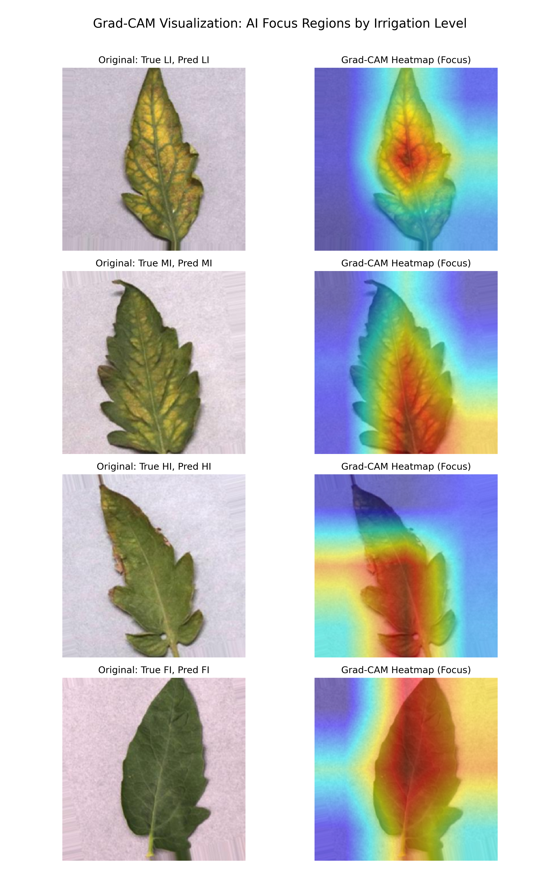

# SmartIrrigation-Vision 🍅💧

**Deep Learning-Based Method for Irrigation Status Detection in Tomato Plants Using Leaf Images**

This repository contains the official implementation of a lightweight Convolutional Neural Network (CNN) designed to automatically detect the irrigation status (water stress levels) of tomato plants by analyzing images of their leaves. 

By utilizing a modified, highly efficient **LightResNet-50** architecture, this project achieves **99.30% testing accuracy** while requiring significantly fewer parameters than standard deep learning models, making it ideal for deployment in precision agriculture.

---

## 📊 Results & Performance

Our model was trained and evaluated on a massive dataset of over 20,000 tomato leaf images, strictly partitioned into Training (70%) and Testing (30%) splits to prevent data leakage.

| Metric | Score |
| :--- | :--- |
| **Accuracy** | 99.30% |
| **Precision (Macro)** | 99.30% |
| **Recall (Macro)** | 99.29% |
| **F1-Score (Macro)** | 99.29% |
| **Cohen's Kappa** | 0.9907 |

### Dataset Classes
The network classifies leaves into four distinct irrigation levels:
1. **LI (Low Irrigated)** - 25% Field Capacity
2. **MI (Medium Irrigated)** - 50% Field Capacity
3. **HI (Highly Irrigated)** - 75% Field Capacity
4. **FI (Fully Irrigated)** - 100% Field Capacity

---

## 🧠 Explainable AI (Grad-CAM)

To ensure our AI is diagnosing water stress based on actual physical symptoms (such as leaf curling, wilting, or yellowing edges) rather than memorizing background pixels, we implemented **Gradient-weighted Class Activation Mapping (Grad-CAM)**. 

The generated heatmaps below demonstrate exactly which regions of the leaf the neural network focuses on to make its final prediction:



*(Red/Yellow regions indicate high model attention)*

---

## 🏗 Architecture: LightResNet-50

Standard ResNet-50 models are powerful but computationally expensive, containing ~23.5 Million parameters. This project utilizes a custom **LightResNet-50** bottleneck architecture.

By replacing standard 3x3 convolutions with optimized combinations of 1x1 shortcut connections and Batch Normalization, we reduced the total trainable parameters to just **1.24 Million** (a 94% reduction) without sacrificing any accuracy.

### Total Trainable Parameters: `1,240,948`

---

## 💻 Installation & Usage

### 1. Requirements
Ensure you have Python 3.8+ installed, then run:
```bash
python3 -m pip install -r requirements.txt
```

### 2. Dataset Setup
Download the "Irrigation Management in Tomato Plants" dataset from Figshare (DOI: `10.6084/m9.figshare.22297915`) and place the extracted folders into a `/dataset` directory at the root of this project.

### 3. Training the Model
To train the LightResNet-50 model from scratch:
```bash
python3 train.py --epochs 40 --batch_size 64 --lr 0.0001
```
The script will automatically detect and utilize Apple Silicon GPUs (MPS) or NVIDIA GPUs (CUDA) if available. It includes Early Stopping (patience=3) to prevent overfitting.

### 4. Visualizing Results
To instantly generate the Grad-CAM heatmaps using the saved `best_model.pth`:
```bash
python3 gradcam_visualizer.py
```
To generate the Confusion Matrix and Class-specific Evaluation charts:
```bash
python3 evaluate.py
```

---

## 📁 Repository Structure

* `model.py`: Contains the PyTorch implementation of the `LightResidualBlock` and `LightResNet50`.
* `dataset_loader.py`: Handles image loading, 70/30 stratified splitting, and PyTorch transformations (Random Cropping, Flipping, Rotation).
* `train.py`: The main training loop with comprehensive epoch metrics tracking.
* `evaluate.py`: Standalone script to generate confusion matrices and test metrics.
* `gradcam_visualizer.py`: Generates the Grad-CAM heatmaps.
* `best_model.pth`: The fully trained weights achieving 99.30% accuracy.
